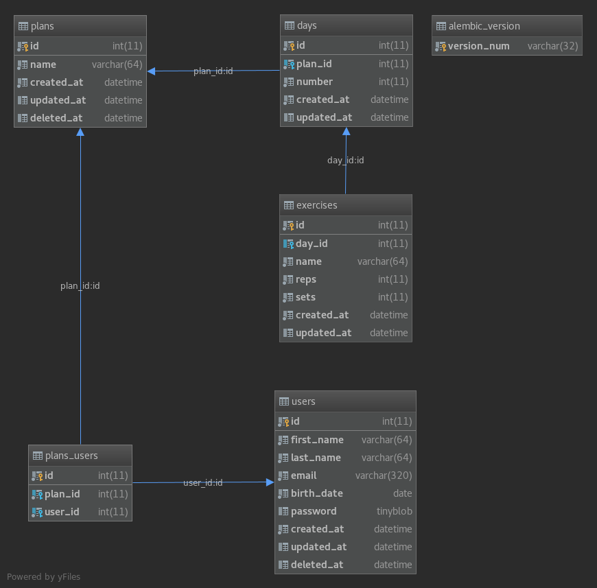

# Workout Management 
Rest API for manage workout plans.

# Dependencies
* Python 3.6
* libffi-devel ([MacOS X](https://stackoverflow.com/a/44707470/756332), [Ubuntu](https://packages.ubuntu.com/xenial/libffi-dev), [Fedora](https://apps.fedoraproject.org/packages/libffi-devel))


# Usage

## Starting application 

### Docker
```bash
$ make start-docker
```

#### Containers
   * `web`: API running on port [`5051`](http://localhost:5051)
   * `db`: MySQL database running on port `3009`

## Sending mail

If a SendGrid API key is configured on [Flask config object](workout_management/config.py#L23), the API will notify users when a plan change and when a user is associated to a plan.

If you need to stop/remove the containers use the following command:
```bash
$ make stop-docker
```

## Running Tests
Make sure you started the mysql container.

```bash
$ make run-tests
```

### Test Coverage
```text
Name                                                 Stmts   Miss  Cover
------------------------------------------------------------------------
workout_management/__init__.py                           0      0   100%
workout_management/app.py                               43      1    98%
workout_management/auth.py                              57      0   100%
workout_management/config.py                            40      0   100%
workout_management/db.py                                 1      0   100%
workout_management/extensions.py                         4      0   100%
workout_management/helpers.py                           25      0   100%
workout_management/middleware.py                         4      0   100%
workout_management/models.py                            73      1    99%
workout_management/resources/__init__.py                 0      0   100%
workout_management/resources/auth/__init__.py            0      0   100%
workout_management/resources/auth/routes.py             27      1    96%
workout_management/resources/auth/schemas.py             5      0   100%
workout_management/resources/error.py                   33      0   100%
workout_management/resources/exercises/__init__.py       0      0   100%
workout_management/resources/exercises/routes.py        75     10    87%
workout_management/resources/exercises/schemas.py       26      0   100%
workout_management/resources/ping.py                     4      0   100%
workout_management/resources/plan/__init__.py            0      0   100%
workout_management/resources/plan/routes.py            141     13    91%
workout_management/resources/plan/schemas.py            37      0   100%
workout_management/resources/user/__init__.py            0      0   100%
workout_management/resources/user/routes.py             58      6    90%
workout_management/resources/user/schemas.py            25      0   100%
workout_management/services.py                          22      4    82%
------------------------------------------------------------------------
TOTAL                                                  700     36    95%
----------------------------------------------------------------------
Ran 58 tests in 91.580s
```

# Documentation
## Swagger specification
[Swagger File](spec/swagger.yaml)

## Database Diagram


